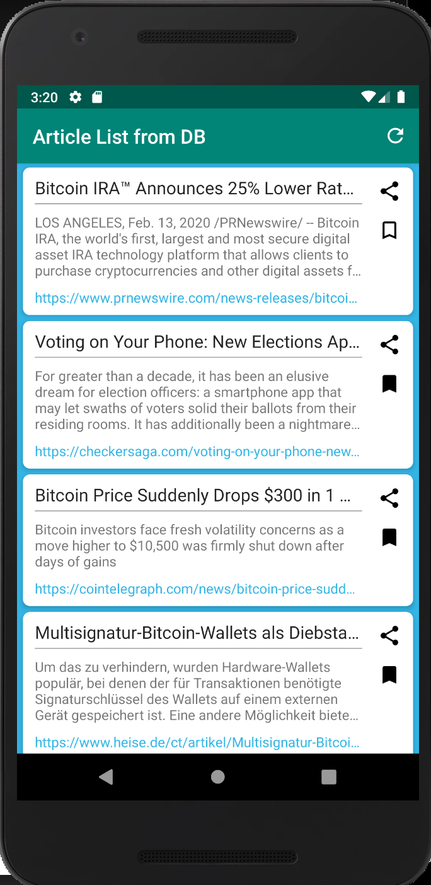

# NewsFeed
News Feed app developed without using external libraries.
Job scheduler used for fetching data periodically in background.
Articles can be bookmarked and shared.

## Screenshots :

  
  

